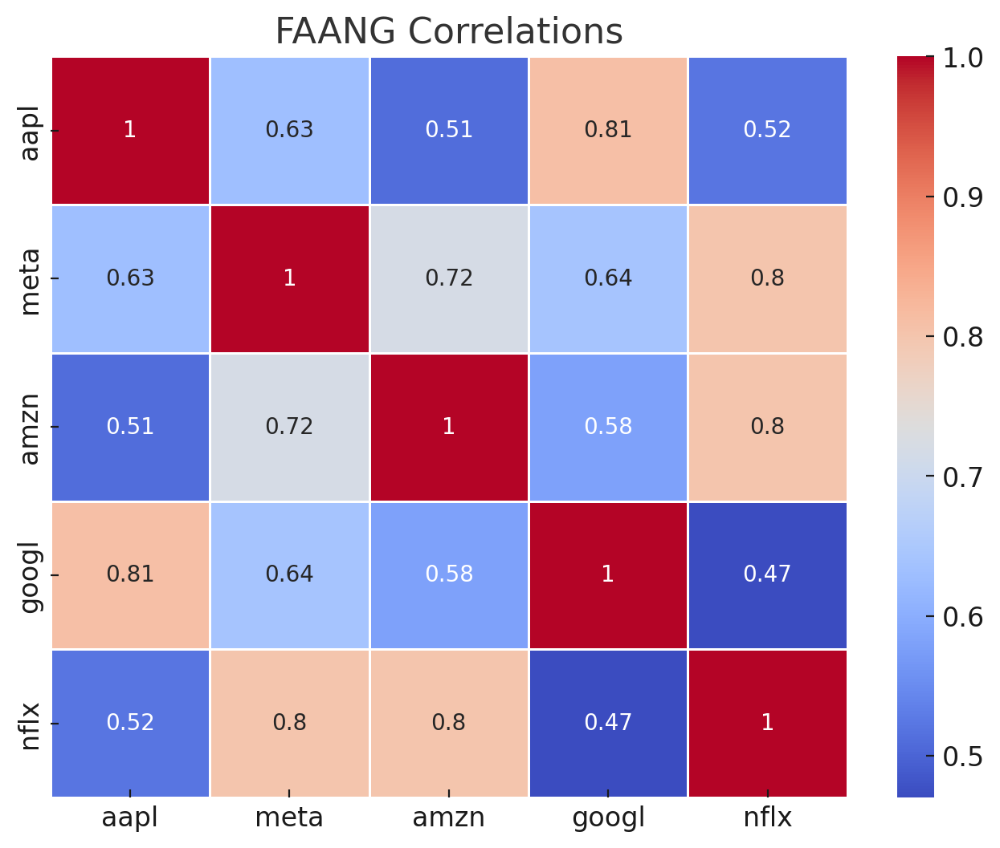
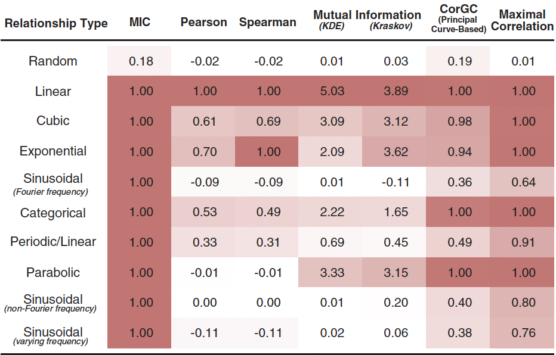
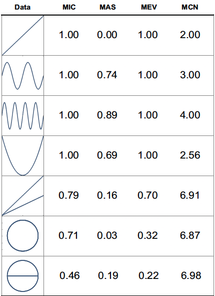
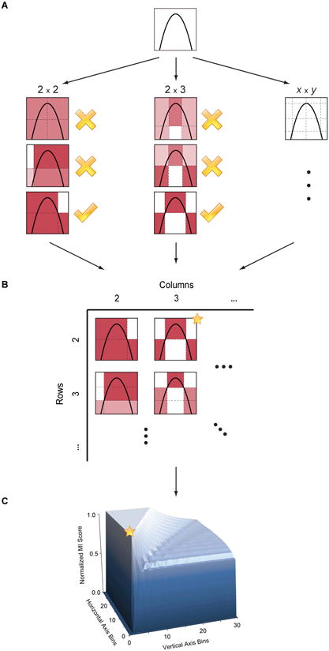

<p align="center">
<p align="center">

  </p>
  <h1 align="center">vasco 🐘📊🔍</h1>
  <p align="center">
  <strong>Find hidden patterns in your Postgres data</strong>
    <br> <br />
    <a href="#usage"><strong> Usage</strong></a> |
    <a href="#installation"><strong> Installation </strong></a> |
    <a href="#reference"><strong> Reference </strong></a> |
    <a href="#how"><strong> How </strong></a>
   </p>
<p align="center">

<p align="center">
<a href="https://github.com/Florents-Tselai/vasco/actions/workflows/build.yml?branch=mainline"></a>

**vasco** is a Postgres extension that helps you discover hidden
correlations in your data. It is based on the [MIC](https://en.wikipedia.org/wiki/Maximal_information_coefficient) and
the [MINE family of
statistics](http://www.exploredata.net).

## Usage

Let's start by populating Postgres with some stock price data for the S&P500.

```shell
psql -f demo/stocks.sql postgres
```

There's now available a `v_sample` view that contains daily closing prices for FAANG and a few other tickers.
We want to explore which of these stock prices are correlated and how strong is that correlation.

### Correlation Pairs

The **Maximal Information Coefficient (MIC)** measures how strong is the
association between to pairs of variables (columns).
For our example, we can compute this by using the `mic(x,y)` aggregate function for each pair of stocks we're interested
in.

Let's pick some arbitrary pairs and compute the MIC for them

```sql
select mic(aapl, nflx)  as aapl_nfxl,
       mic(aapl, googl) as aapl_googl,
       mic(aapl, ba)    as aapl_ba,
       mic(ba, pg)      as ba_pg,
       mic(pg, gm)      as pg_gm
from v_sample
```

| aapl_nfxl | aapl_googl | aapl_ba | ba_pg | pg_gm |
|:----------|:-----------|:--------|:------|:------|
| 0.51      | 0.80       | 0.55    | 0.48  | 0.32  |

We can see that Apple's stock price is strongly correlated with Google's,
while with Netflix's, not so much.
The correlation strength between Procter & Gamble (PG) is not really associated
with Boeing's (BA) price.

### Exploring a table

To exhaustively explore the correlations between all stock pairs in a relation we can do it in one go:

```sql
select vasco_corr_matrix('v_faang', 'mic_v_faang')
```

This will compute the MIC for all column pairs in `v_faang` and store
the correlation matrix as a new table `mic_v_faang`.

| col   | aapl | meta | amzn | googl | nflx |
|-------|------|------|------|-------|------|
| aapl  | 1.00 | 0.63 | 0.51 | 0.81  | 0.52 |
| meta  | 0.63 | 1.00 | 0.72 | 0.64  | 0.80 |
| amzn  | 0.51 | 0.72 | 1.00 | 0.58  | 0.80 |
| googl | 0.81 | 0.64 | 0.58 | 1.00  | 0.47 |
| nflx  | 0.52 | 0.80 | 0.80 | 0.47  | 1.00 |

Here's a plot of this correlation matrix as a heatmap



### Additional Metrics: Exploring the association

No algorithm can magically detect the function of the relationship
between two variables, but MINE statistics can shed some light into the
nature of that relationship.

| Metric                                          | SQL Function               | Interpretation                                                                                                                                                |
|-------------------------------------------------|----------------------------|---------------------------------------------------------------------------------------------------------------------------------------------------------------|
| Maximum Asymmetry Score (MAS)                   | `SELECT mas(X, Y)`         | measures how much the relationship deviates from monotonicity                                                                                                 |
| Maximum Edge Value (MEV)                        | `SELECT mev(X, Y)`         | measures the degree to which the dataset appears to be sampled from a continuous function.                                                                    |
| Minimum Cell Number (MCN)                       | `SELECT mcn(X, Y`)         | measures the complexity of the association.                                                                                                                   |
| Minimum Cell Number General (MCNG)              | `SELECT mcn_general(X, Y)` | returns the MCN with `eps = 1 - MIC`                                                                                                                          |
| Total Information Coefficient (TIC)             | `SELECT tic(X, Y)`         | returns the total information coefficient                                                                                                                     |
| Generalized Mean Information Coefficient (GMIC) | `SELECT gmic(X, Y)`        | generalization of MIC which incorporates a tuning parameter that can be used to modify the complexity of the association favored by the measure [Luedtke2013] |


### Choosing an estimator

There have been proposed a number of algorithms to estimate the MIC.
Currently in **vasco** you can choose between `ApproxMIC` from
Reshef2011 or `MIC_e` from Reshef2016 .

``` sql
SET vasco.mic_estimator = ApproxMIC
SET vasco.mic_estimator = MIC_e
```

### pgvector support

**vasco** can be build with
[pgvector](https://github.com/pgvector/pgvector) support .

In that case all MINE statistics can be computed between `vector` types
too.

``` sql
SELECT mic(  ARRAY [0,1.3,2,0,1.3,20,1.3,20,1.3,20,1.3,20,1.3,2]::float4[]::vector,
             ARRAY [0,1.3,2,0,1.3,20,1.3,20,1.3,20,1.3,20,1.3,2]::float4[]::vector
         )
```

### Configuration parameters

The following MINE parameters can be set via GUC.

- `vasco.mine_c`
- `vasco.mine_alpha`
- `vasco.mic_estimator`
- `vasco.mine_mcn_eps`
- `vasco.mine_tic_norm`
- `vasco.mine_gmic_p`

## Installation

``` sh
cd /tmp
git clone git@github.com:Florents-Tselai/vasco.git
cd vasco
make all # WITH_PGVECTOR=1 to enable pgvector support
make install # may need sudo
```

Then in a Postgres session run

``` sql
CREATE EXTENSION vasco
```

## How

The main workhorse behind vasco is the
[MIC](https://en.wikipedia.org/wiki/Maximal_information_coefficient) an information theory-based
measure of association that can capture a wide range of functional and
non-functional relationships between variables.

`MIC(X,Y)` is symmetric and normalized score into a range `[0, 1]`. A
high MIC value suggests a dependency between the investigated variables,
whereas `MIC=0` describes the relationship between two independent
variables.



> The maximal information coefficient (MIC) is a measure of two-variable
> dependence designed specifically for rapid exploration of
> many-dimensional data sets. MIC is part of a larger family of maximal
> information-based nonparametric exploration (MINE) statistics, which
> can be used not only to identify important relationships in data sets
> but also to characterize them.
>
> Intuitively, MIC is based on the idea that if a relationship exists
> between two variables, then a grid can be drawn on the scatterplot of
> the two variables that partitions the data to encapsulate that
> relationship.
>
> Thus, to calculate the MIC of a set of two-variable data, we explore
> all grids up to a maximal grid resolution, dependent on the sample
> size computing for every pair of integers `(x,y)` the largest possible
> mutual information achievable by any x-by-y grid applied to the data.
> We then normalize these mutual information values to ensure a fair
> comparison between grids of different dimensions and to obtain
> modified values between 0 and 1.
>
> These different combination of grids form the so-called
> **characteristic matrix M(x,y)** of the data. Each element `(x,y)` of
> M stores the highest normalized mutual information achieved by any
> x-by-y grid. Computing `M` is the core of the algorithmic process and
> is computationally expensive. The maximum of `M` is the MIC and the
> rest of MINE statistics are derived from that matrix as well.

**TL;DR**: Computing the *Characteristic Matrix* is the big deal; Once
that is done, computing the statistics is trivial.





## Next Steps

- Try out ChiMIC [Chen2013] and BackMIC
- Currently `M` is re-computed every time a function score is called.
  That\'s a huge waste of resources. Caching `M` or sharing it between
  runs should be the first optimization to be done.
- A potential next step would be continuously updating the CM as
  columns are updated (think a trigger or bgw process).
- Make an extension for SQLite and DuckDB as well
- Build convenience functions to create variable pairs and explore
  tables in one pass.

## Thanks

For MINE statistics, **vasco** currently uses the implementation
provided by Albanese2013 via the [minepy](https://github.com/minepy/minepy) package.

Alternative implementations are coming up.

## References

- **Albanese2013**: Albanese, D., Filosi, M., Visintainer, R., Riccadonna, S., Jurman, G., & Furlanello, C. (2013). Minerva and minepy: a C engine for the MINE suite and its R, Python and MATLAB wrappers. Bioinformatics, 29(3), 407-408.

- **Albanese2018**: Davide Albanese, Samantha Riccadonna, Claudio Donati, Pietro Franceschi; A practical tool for Maximal Information Coefficient analysis, GigaScience, giy032, [https://doi.org/10.1093/gigascience/giy032](https://doi.org/10.1093/gigascience/giy032)

- **Cao2021**: Cao, D., Chen, Y., Chen, J., Zhang, H., & Yuan, Z. (2021). An improved algorithm for the maximal information coefficient and its application. Royal Society open science, 8(2), 201424. [PDF](https://royalsocietypublishing.org/doi/pdf/10.1098/rsos.201424) [GitHub](https://github.com/Caodan82/BackMIC)

- **Chen2013**: Chen Y, Zeng Y, Luo F, Yuan Z. 2016 A new algorithm to optimize maximal information coefficient. PLoS ONE 11, e0157567. [doi:10.1371/journal.pone.0157567](https://doi.org/10.1371/journal.pone.0157567) [GitHub](https://github.com/chenyuan0510/Chi-MIC)

- **Ge2016**: Ge, R., Zhou, M., Luo, Y. et al. McTwo: a two-step feature selection algorithm based on maximal information coefficient. BMC Bioinformatics 17, 142 (2016). [https://doi.org/10.1186/s12859-016-0990-0](https://doi.org/10.1186/s12859-016-0990-0)

- **Luedtke2013**: Luedtke A., Tran L. The Generalized Mean Information Coefficient. [https://doi.org/10.48550/arXiv.1308.5712](https://doi.org/10.48550/arXiv.1308.5712)

- **Matejka2017**: J. Matejka and G. Fitzmaurice. Same Stats, Different Graphs: Generating Datasets with Varied Appearance and Identical Statistics through Simulated Annealing. ACM SIGCHI Conference on Human Factors in Computing Systems, 2017.

- **Reshef2011**: Reshef, D. N., Reshef, Y. A., Finucane, H. K., Grossman, S. R., McVean, G., Turnbaugh, P. J., ... & Sabeti, P. C. (2011). Detecting novel associations in large data sets. Science, 334(6062), 1518-1524.

- **Reshef2016**: Yakir A. Reshef, David N. Reshef, Hilary K. Finucane, Pardis C. Sabeti, and Michael Mitzenmacher. Measuring Dependence Powerfully and Equitably. Journal of Machine Learning Research, 2016. [PDF](https://jmlr.csail.mit.edu/papers/volume17/15-308/15-308.pdf)

- **Shao2021**: Shao, F. & Liu, H. (2021). The Theoretical and Experimental Analysis of the Maximal Information Coefficient Approximate Algorithm. Journal of Systems Science and Information, 9(1), 95-104. [https://doi.org/10.21078/JSSI-2021-095-10](https://doi.org/10.21078/JSSI-2021-095-10)

- **Xu2016**: Xu, Z., Xuan, J., Liu, J., & Cui, X. (2016, March). MICHAC: Defect prediction via feature selection based on maximal information coefficient with hierarchical agglomerative clustering. In 2016 IEEE 23rd International Conference on Software Analysis, Evolution, and Reengineering (SANER) (Vol. 1, pp. 370-381). IEEE. [http://cstar.whu.edu.cn/paper/saner_16.pdf](http://cstar.whu.edu.cn/paper/saner_16.pdf)

- **Zhang2014**: Zhang Y, Jia S, Huang H, Qiu J, Zhou C. 2014 A novel algorithm for the precise calculation of the maximal information coefficient. Sci. Rep.-UK 4, 6662. [doi:10.1038/srep06662](https://doi.org/10.1038/srep06662) [http://lxy.depart.hebust.edu.cn/SGMIC/SGMIC.htm](http://lxy.depart.hebust.edu.cn/SGMIC/SGMIC.htm)
