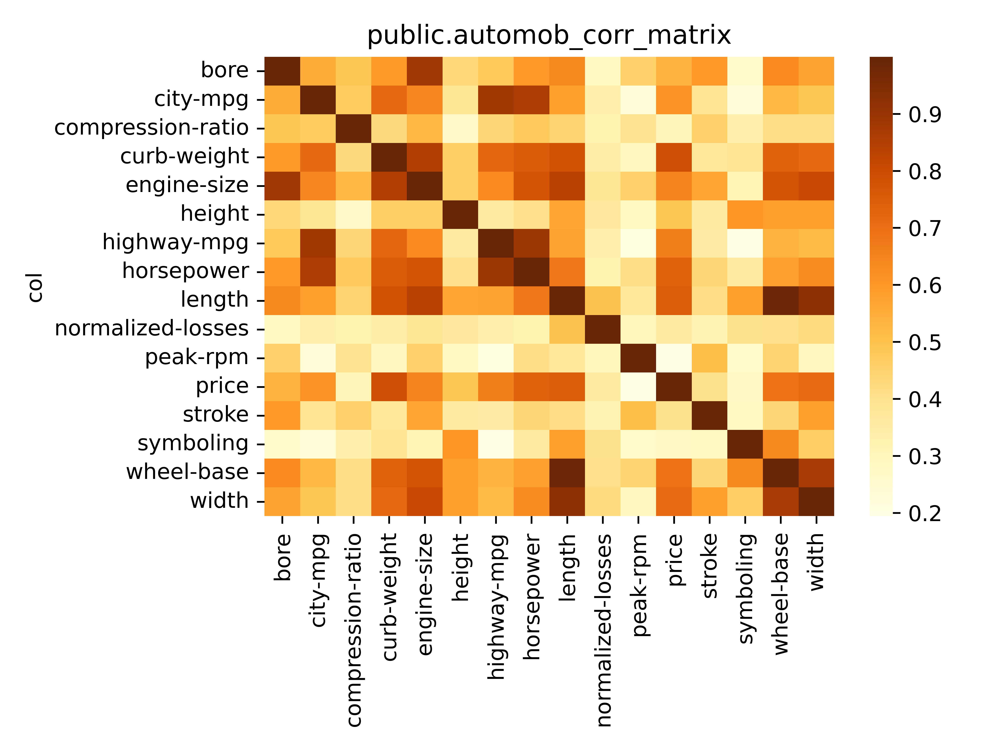

vasco: discover hidden correlations in your data
================================================

**vasco** is a Postgres extension that helps you discover hidden correlations in your data.
It is based on the `MINE family of statistics <http://www.exploredata.net>`_.

Using the Automobile dataset found in ``demo/data`` as an example.

.. code-block:: sql

    SELECT vasco_corr_matrix('vasco_demo."Automobile_data"', 'auto_corr_matrix')

**vasco** will explore the table created above for relationships between its columns.
A symmetric matrix of their correlations will be stored in the table ``auto_corr_matrix``.

You can then use the utility script below to plot a heatmap of the matrix.

.. code-block:: sh

    ./scripts/plot_corr_matrix.py 'public.auto_corr_matrix'

*Note*: this can grow exponentially based on the number of columns in the table.

The main workhorse behind vasco is the
`MIC <https://en.wikipedia.org/wiki/Maximal_information_coefficient>`_ [Reshef2011]_:
an information theory-based measure of association
that can capture a wide range of functional and non-functional
relationships between variables.

``MIC(X,Y)`` is symmetric and normalized score into a range ``[0, 1]``.
A high MIC value suggests a dependency between the investigated variables,
whereas ``MIC=0`` describes the relationship between two independent variables.

.. image:: docs/img/mic_comparison.png

**Table of contents**

.. contents:: :local:

Installation
------------

.. code-block:: sh

    cd /tmp
    git clone git@github.com:Florents-Tselai/vasco.git
    cd vasco
    make all # WITH_PGVECTOR=1 to enable pgvector support
    make install # may need sudo

Then in a Postgres session run

.. code-block:: sql

    CREATE EXTENSION vasco

Usage
-----

**vasco** exposes a set of Postgres functions to compute MINE statistics
between two series ``(X,Y)`` .
In Postgres terms ``X`` and ``X`` can be arrays, vectors or columns.

Thus, each score function is available in three flavors:
using Postgres arrays as argument ``f(float8[], float8[])``,
, `pgvector <https://github.com/pgvector/pgvector>`_ vectors ``f(vector, vector)``
or columns (hence ``f`` is an aggregate function).
Necessary MINE parameters can be set as `GUC <https://www.postgresql.org/docs/current/config-setting.html>`_ ,
(prefixed as ``vasco.*``)

Let's discuss the supported statistics and their interpretation.
Start by creating a sample dataset

.. code-block:: sql

    SET extra_float_digits = 0;

    CREATE TABLE vasco_data
    AS (SELECT RANDOM()                          AS rand_x,
               RANDOM()                          AS rand_y,
               x                                 AS x,
               x                                 AS ident,
               4 * pow(x, 3) + pow(x, 2) - 4 * x AS cubic,
               COS(12 * PI() + x * (1 + x))      AS periodic
        FROM GENERATE_SERIES(0, 1, 0.001) x);

Exploring a table
^^^^^^^^^^^^^^^^^

city-mpg	0.552852488581861	0.7147647419695118	0.6417165322528822	0.3826621272924302	0.5824225000761548	0.3332829856817427	0.2255758710444735	0.5239248652777706	0.4932457112181439	0.9998487233546853	0.4713353602285628	0.8645511827341567	0.22871218496027723	0.3926177718172348	0.8814100321045885	0.6098911887653564
compression-ratio	0.4907246169740423	0.424615740370985	0.5265466181960898	0.2648130957915103	0.44748444282516175	0.3181635773724666	0.33100614210866786	0.40968128860707786	0.4094221058283898	0.4713353602285628	0.9998487233546853	0.47768673660164407	0.39591298243176815	0.45591085417975885	0.43710845991644315	0.3047738899903641
highway-mpg	0.4784730381197567	0.7228129179516329	0.6341391394183956	0.3594757926908785	0.574180545046765	0.33568358969201256	0.19451735863896055	0.5402668295409895	0.5194199332236188	0.8814100321045885	0.43710845991644315	0.8907268791672682	0.20665971892689664	0.35150589009072863	0.999200186032496	0.6616403412958671
horsepower	0.5986791059710929	0.7535238265088974	0.7746311339323187	0.4061364024129889	0.6800298101670189	0.32036150752721176	0.36379592181079545	0.5783848336683439	0.631666651145363	0.8645511827341567	0.47768673660164407	0.9998487233546853	0.41226659097668134	0.4376475589072009	0.8907268791672682	0.7388294696531824
peak-rpm	0.4546388771843797	0.28967320149862213	0.4559858634827706	0.28309277561225743	0.37189672293442894	0.2982513518672078	0.26243284071106526	0.44413626515828053	0.29052134394541335	0.22871218496027723	0.39591298243176815	0.41226659097668134	0.9998455119707889	0.5098052544602802	0.20665971892689664	0.19661612520818103
price	0.5356892558304049	0.7915133351790599	0.6497608017545748	0.4920630496845614	0.749038025455503	0.35772490288469866	0.2793687094467325	0.6919318924073476	0.7109471686424146	0.6098911887653564	0.3047738899903641	0.7388294696531824	0.19661612520818103	0.4047468856358604	0.6616403412958671	0.9999828352080613
bore	0.9998487233546853	0.596750480815666	0.8840799697913776	0.4305998803502798	0.6404263164577264	0.28410717732004936	0.2635273684189018	0.6348987971797961	0.5759974010820106	0.552852488581861	0.4907246169740423	0.5986791059710929	0.4546388771843797	0.5980466408522787	0.4784730381197567	0.5356892558304049
curb-weight	0.596750480815666	0.9999828352080613	0.8495993425719032	0.4590104912223354	0.7825743843684577	0.3460253579077079	0.3910924040190958	0.7361043940436839	0.7152779892110706	0.7147647419695118	0.424615740370985	0.7535238265088974	0.28967320149862213	0.37075239940810634	0.7228129179516329	0.7915133351790599
engine-size	0.8840799697913776	0.8495993425719032	0.9999828352080611	0.46146788638116903	0.8376638538416045	0.38707651833815165	0.3085024795190157	0.7761361445502902	0.8060130589582593	0.6417165322528822	0.5265466181960898	0.7746311339323187	0.4559858634827706	0.5678153614715821	0.6341391394183956	0.6497608017545748
height	0.4305998803502798	0.4590104912223354	0.46146788638116903	0.9995708393473228	0.5665460141624528	0.3654284273183608	0.6037390140611645	0.5832435291912339	0.5857136523525326	0.3826621272924302	0.2648130957915103	0.4061364024129889	0.28309277561225743	0.3562340793344398	0.3594757926908785	0.4920630496845614
stroke	0.5980466408522787	0.37075239940810634	0.5678153614715821	0.3562340793344398	0.41518591963460344	0.3160590898483231	0.28403309655454545	0.43620597263164473	0.5876681334028298	0.3926177718172348	0.45591085417975885	0.4376475589072009	0.5098052544602802	0.9998455119707889	0.35150589009072863	0.4047468856358604
length	0.6404263164577264	0.7825743843684577	0.8376638538416045	0.5665460141624528	0.9998487233546853	0.49686882258413273	0.5853240460734433	0.9823748328937351	0.9216995965428063	0.5824225000761548	0.44748444282516175	0.6800298101670189	0.37189672293442894	0.41518591963460344	0.574180545046765	0.749038025455503
normalized-losses	0.28410717732004936	0.3460253579077079	0.38707651833815165	0.3654284273183608	0.49686882258413273	0.9998487233546853	0.4051719846183415	0.4074957182689898	0.42198395307089254	0.3332829856817427	0.3181635773724666	0.32036150752721176	0.2982513518672078	0.3160590898483231	0.33568358969201256	0.35772490288469866
symboling	0.2635273684189018	0.3910924040190958	0.3085024795190157	0.6037390140611645	0.5853240460734433	0.4051719846183415	0.9924170618949029	0.6391423572988388	0.46569242355170365	0.2255758710444735	0.33100614210866786	0.36379592181079545	0.26243284071106526	0.28403309655454545	0.19451735863896055	0.2793687094467325
wheel-base	0.6348987971797961	0.7361043940436839	0.7761361445502902	0.5832435291912339	0.9823748328937351	0.4074957182689898	0.6391423572988388	0.9999828352080611	0.8696417776201123	0.5239248652777706	0.40968128860707786	0.5783848336683439	0.44413626515828053	0.43620597263164473	0.5402668295409895	0.6919318924073476
width	0.5759974010820106	0.7152779892110706	0.8060130589582593	0.5857136523525326	0.9216995965428063	0.42198395307089254	0.46569242355170365	0.8696417776201123	0.9996982833200945	0.4932457112181439	0.4094221058283898	0.631666651145363	0.29052134394541335	0.5876681334028298	0.5194199332236188	0.7109471686424146

A more generic approach is the following.

.. code-block:: sql

    SELECT * FROM vasco_explore('my_schema.my_table')

This will explore the relationships between all possible column pairs
in the table and return a detailed table of the results.
Including all MINE statistics and additional metadata.

Coming up: an option to reduce the set of columns to consider.

Exploring association strength
^^^^^^^^^^^^^^^^^^^^^^^^^^^^^^^

The **Maximal Information Coefficient (MIC)** measures how strong is the association.

.. code-block:: sql

    SELECT mic(rand_x, rand_y), -- 0.13 approaching to 0 as sample grows (random independent variables)
           mic(x, ident),       -- 1 identity function hence easy to estimate even with a small sample size
           mic(x, cubic),       -- 0.999 approaching to 1 as sample grows
           mic(x, periodic)     -- 1.
    FROM vasco_data;

Exploring the nature of the association
^^^^^^^^^^^^^^^^^^^^^^^^^^^^^^^^^^^^^^^

No algorithm can magically detect the function of the relationship between two variables,
but MINE statistics can shed some light into the nature of that relationship.

The **Maximum Asymmetry Score (MAS)**
measures how much the relationship deviates from monotonicity.

.. code-block:: sql

    SELECT mas(X, Y)

The **Maximum Edge Value (MEV)**
measures the degree to which the dataset appears to be sampled from a continuous function.

.. code-block:: sql

    SELECT mev(X, Y)

The **Minimum Cell Number (MCN)**
measures the complexity of the association.

.. code-block:: sql

    SET vasco.mine_mcn_eps = 0.0 -- default
    SELECT mcn(X, Y)

The **Minimum Cell Number General (MCNG)**
returns the MCN with eps = 1 - MIC .

.. code-block:: sql

    SELECT mcn_general(X, Y)

The **Total Information Coefficient (TIC)** .

.. code-block:: sql

    SET vasco.mine_tic_norm = true -- normalized or not (default = true)
    SELECT tic(X, Y)

The **Generalized Mean Information Coefficient (GMIC)** ,
a generalization of MIC which incorporates a tuning parameter
that can be used to modify the complexity of the association favored by the measure [Luedtke2013]_ .

.. code-block:: sql

    SET vasco.mine_gmic_p = 0.0
    SELECT gmic(X, Y)

Choosing an estimator
^^^^^^^^^^^^^^^^^^^^^

There have been proposed a number of algorithms to estimate the MIC.
Currently in **vasco** you can choose between
``ApproxMIC`` from [Reshef2011]_ or ``MIC_e`` from [Reshef2016]_ .

.. code-block:: sql

    SET vasco.mic_estimator = ApproxMIC
    SET vasco.mic_estimator = MIC_e

pgvector support
^^^^^^^^^^^^^^^^

**vasco** can be build with `pgvector <https://github.com/pgvector/pgvector>`_ support .

In that case all MINE statistics can be computed between ``vector`` types too.

.. code-block:: sql

   SELECT mic(  ARRAY [0,1.3,2,0,1.3,20,1.3,20,1.3,20,1.3,20,1.3,2]::float4[]::vector,
                ARRAY [0,1.3,2,0,1.3,20,1.3,20,1.3,20,1.3,20,1.3,2]::float4[]::vector
            )

Configuration parameters
^^^^^^^^^^^^^^^^^^^^^^^^

The following MINE parameters can be set via GUC.

* ``vasco.mine_c``
* ``vasco.mine_alpha``
* ``vasco.mic_estimator``
* ``vasco.mine_mcn_eps``
* ``vasco.mine_tic_norm``
* ``vasco.mine_gmic_p``

How it works
------------

As described in [Reshef2011]_ :

    The maximal information coefficient (MIC)
    is a measure of two-variable dependence designed specifically
    for rapid exploration of many-dimensional data sets.
    MIC is part of a larger family of maximal information-based nonparametric exploration (MINE)
    statistics, which can be used not only to identify important relationships in data sets
    but also to characterize them.

    Intuitively, MIC is based on the idea that if a relationship
    exists between two variables,
    then a grid can be drawn on the scatterplot of the two
    variables that partitions the data to encapsulate
    that relationship.

    Thus, to calculate the MIC of a
    set of two-variable data, we explore all grids up
    to a maximal grid resolution, dependent on the
    sample size computing for every pair of integers ``(x,y)``
    the largest possible mutual information
    achievable by any x-by-y grid applied
    to the data. We then normalize these mutual
    information values to ensure a fair comparison
    between grids of different dimensions and to obtain
    modified values between 0 and 1.

    These different combination of grids form
    the so-called **characteristic matrix M(x,y)** of the data.
    Each element ``(x,y)`` of M stores the highest normalized mutual information
    achieved by any x-by-y grid.
    Computing ``M`` is the core of the algorithmic process and is computationally expensive.
    The maximum of ``M`` is the MIC and the rest of MINE statistics are derived from that matrix as well.

**TL;DR**: Computing the *Characteristic Matrix* is the big deal;
Once that is done, computing the statistics is trivial.

.. image:: docs/img/mine_family.png

.. image:: docs/img/computing_mic.jpg

Next Steps
----------

* Try out ChiMIC [Chen2013]_ and BackMIC [Cao2021]_:
* Currently ``M`` is re-computed every time a function score is called. That's a huge waste of resources. Caching ``M`` or sharing it between runs should be the first optimization to be done.
* A potential next step would be continuously updating the CM as columns are updated (think a trigger or bgw process).
* Make an extension for SQLite and DuckDB as well
* Build convenience functions to create variable pairs and explore tables in one pass.

Thanks
------

For MINE statistics, **vasco** currently uses the implementation provided by [Albanese2013]_ via the
`minepy <https://github.com/minepy/minepy>`_ package.

Alternative implementations are coming up.

Resources
---------

.. [Reshef2011] Reshef, D. N., Reshef, Y. A., Finucane, H. K., Grossman, S. R., McVean, G., Turnbaugh, P. J., ... & Sabeti, P. C. (2011). Detecting novel associations in large data sets. science, 334(6062), 1518-1524.

.. [Albanese2013] Albanese, D., Filosi, M., Visintainer, R., Riccadonna, S., Jurman, G., & Furlanello, C. (2013). Minerva and minepy: a C engine for the MINE suite and its R, Python and MATLAB wrappers. Bioinformatics, 29(3), 407-408.

.. [Luedtke2013] Luedtke A., Tran L. The Generalized Mean Information Coefficient  https://doi.org/10.48550/arXiv.1308.5712

.. [Chen2013] Chen Y, Zeng Y, Luo F, Yuan Z. 2016 A new algorithm to optimize maximal information coefficient. PLoS ONE 11, e0157567. (doi:10. 1371/journal.pone.0157567) `GitHub <https://github.com/chenyuan0510/Chi-MIC>`_

.. [Zhang2014] Zhang Y, Jia S, Huang H, Qiu J, Zhou C. 2014 A novel algorithm for the precise calculation of the maximal information coefficient. Sci. Rep.-UK 4, 6662. (doi:10.1038/ srep06662) http://lxy.depart.hebust.edu.cn/SGMIC/SGMIC.htm

.. [Ge2016] Ge, R., Zhou, M., Luo, Y. et al. McTwo: a two-step feature selection algorithm based on maximal information coefficient. BMC Bioinformatics 17, 142 (2016). https://doi.org/10.1186/s12859-016-0990-0

.. [Reshef2016] Yakir A. Reshef, David N. Reshef, Hilary K. Finucane and Pardis C. Sabeti and Michael Mitzenmacher. Measuring Dependence Powerfully and Equitably. Journal of Machine Learning Research, 2016. `PDF <https://jmlr.csail.mit.edu/papers/volume17/15-308/15-308.pdf>`_

.. [Xu2016] Xu, Z., Xuan, J., Liu, J., & Cui, X. (2016, March). MICHAC: Defect prediction via feature selection based on maximal information coefficient with hierarchical agglomerative clustering. In 2016 IEEE 23rd International Conference on Software Analysis, Evolution, and Reengineering (SANER) (Vol. 1, pp. 370-381). IEEE. http://cstar.whu.edu.cn/paper/saner_16.pdf

.. [Matejka2017] J. Matejka and G. Fitzmaurice. Same Stats, Different Graphs: Generating Datasets with Varied Appearance and Identical Statistics through Simulated Annealing. ACM SIGCHI Conference on Human Factors in Computing Systems, 2017.

.. [Albanese2018] Davide Albanese, Samantha Riccadonna, Claudio Donati, Pietro Franceschi; A practical tool for Maximal Information Coefficient analysis, GigaScience, giy032, https://doi.org/10.1093/gigascience/giy032

.. [Cao2021] Cao, D., Chen, Y., Chen, J., Zhang, H., & Yuan, Z. (2021). An improved algorithm for the maximal information coefficient and its application. Royal Society open science, 8(2), 201424. `PDF <https://royalsocietypublishing.org/doi/pdf/10.1098/rsos.201424>`_ `GitHub <https://github.com/Caodan82/BackMIC>`_

.. [Shao2021] Shao, F. & Liu, H. (2021). The Theoretical and Experimental Analysis of the Maximal Information Coefficient Approximate Algorithm. Journal of Systems Science and Information, 9(1), 95-104. https://doi.org/10.21078/JSSI-2021-095-10

